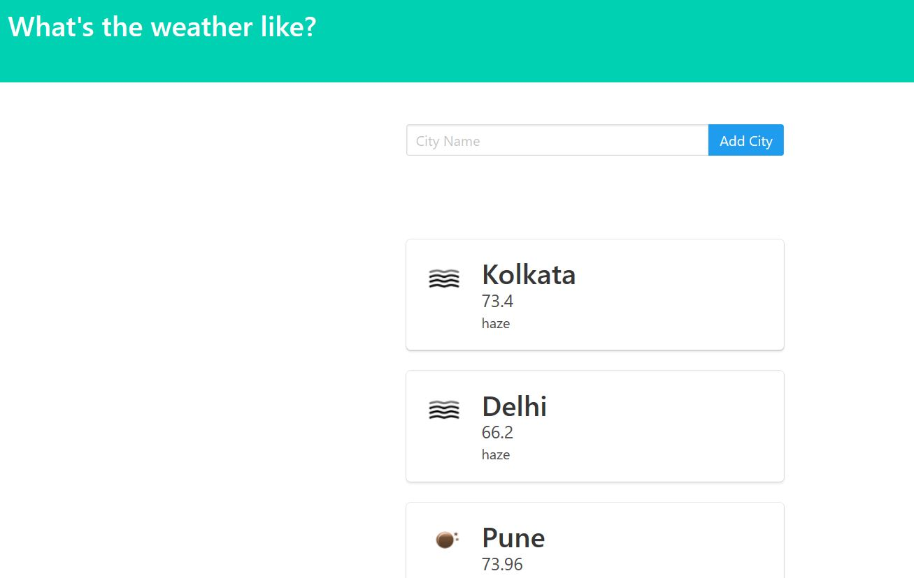

# Weather Forecast App
Build a weather app to predict the state of the atmosphere of the given location

## Screenshot

## Features

* Simple and easy to use
* Allow you to check atmosphere of any given location
* Allow you to store multiple cities information at a time

## Setup and Installations

* Install python 3 (https://www.python.org/downloads/)
* python -m pip install Django (https://docs.djangoproject.com/en/3.0/topics/install/)
* Use any ide like pycharm, visual studio etc
* create project by - django-admin startproject projectname
* start a app by - python manage.py startapp appname
* specify your appname inside a installed app list in settings.py
* setup the templates folder inside templates[] in settings.py
* use weather api from (https://openweathermap.org/current)
